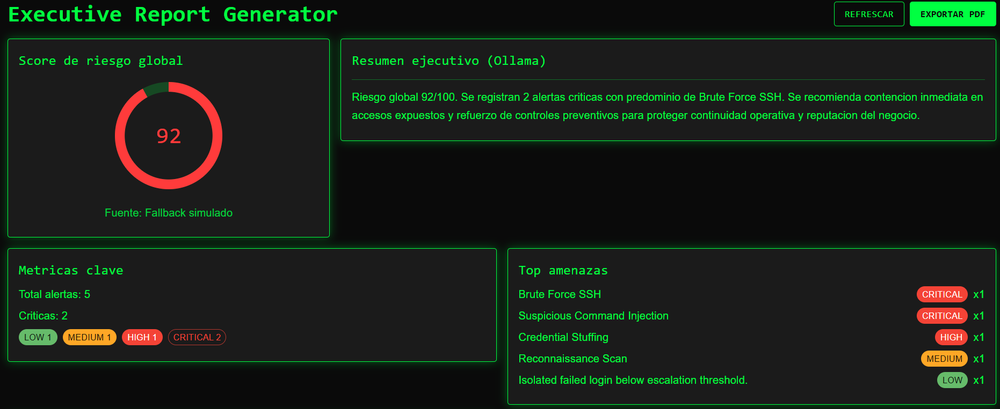
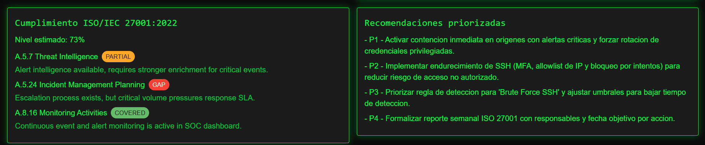

# Executive Report Generator - Valhalla SOC

Módulo de análisis ejecutivo para el proyecto **Valhalla SOC**. Esta vista transforma datos técnicos de eventos y alertas en información de negocio accionable para facilitar decisiones de riesgo, priorización de respuesta y seguimiento de cumplimiento.

## Características

- Interfaz estilo HUD/terminal SOC (fondo oscuro, acento verde, tipografía monospace).
- Cálculo de score de riesgo global (0-100) con gauge visual.
- Resumen ejecutivo en lenguaje de negocio con soporte de análisis IA (Ollama).
- Métricas clave: total de alertas, críticas y distribución por severidad.
- Top amenazas priorizadas por frecuencia e impacto.
- Evaluación estimada de cumplimiento ISO/IEC 27001:2022.
- Recomendaciones priorizadas para remediación.
- Exportación a PDF desde navegador.
- Modo fallback con datos simulados realistas si el backend no está disponible.

## Stack técnico

- Frontend: React 19 + TypeScript + Vite
- UI: Material UI (MUI)
- Integración API: Fetch hacia FastAPI
- IA local: Ollama (endpoint de análisis)
- Base de datos del sistema: PostgreSQL (consumida indirectamente por backend)

## Endpoints que consume

- `GET /events?limit=100&offset=0`
- `GET /alerts?limit=100&offset=0`
- `POST /api/analyze/{alert_id}`

Base esperada de API:
- `http://localhost:8000` (o `VITE_API_BASE_URL` cuando aplique)

## Cómo ejecutar en local

1. Ir a la carpeta de frontend:
   - `cd frontend`
2. Instalar dependencias:
   - `npm install`
3. Levantar entorno de desarrollo:
   - `npm run dev`
4. Abrir en navegador:
   - Dashboard general: `http://localhost:3000/`
   - Reporte ejecutivo: `http://localhost:3000/executive-report`

## Fallback sin Docker

Si Docker o backend no están corriendo, el módulo sigue operativo en modo aislado:

- Si fallan `GET /events` o `GET /alerts`, se cargan datasets simulados realistas.
- Si falla `POST /api/analyze/{alert_id}`, se utiliza resumen ejecutivo alternativo.
- La UI, métricas, score, top amenazas, ISO y recomendaciones siguen visibles para demo.

## Autora

- **Julieta**
- **Rol:** Análisis
